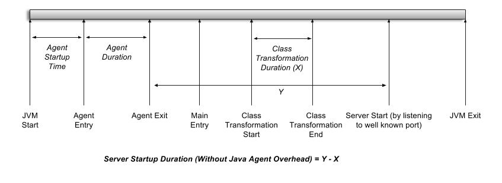

# Startup Time Measuring Agent

## Introduction

Usually most servers (eg. WSO2, MSF4J, Tomcat, Spring Boot) print the server startup time in a log.

However, I needed a way to measure the startup time of a server multiple times and analyze the results quickly.

I have also noticed that the first server startup time after the OS is booted is usually taking a longer time.

In order to measure the startup time of a server, we need to measure time from the execution of the server to the time the
 HTTP port starts listening. When the server starts listening to a port, it is ready to accept requests.

Measuring the startup time is important when we need to start a service quickly, for example, the startup time is
 included in the first request latency if we want to run a server in serverless mode and serve the requests.

This Java Agent can measure the startup time of a server listening to a well-known port and print values to a CSV file.

The Java Agent overhead is minimized by using the Java instrumentation API directly and modifying the Java class
 bytecode using Javassist.

## How the startup time is measured

With the Java Agent, there are several measurements taken at different points and the values are written to a CSV file
 at the JVM exit.

See following diagram showing the program timeline and the different points used to take measurements.

The columns in the CSV file are `"Agent Startup Time (ms)", "Agent Entry Uptime (ms)", "Agent Duration (ms)",
"Class Transformation Duration (ms)", "Server Startup Time (ms)", "Server Start Uptime (ms)",
"Server Startup Duration (ms)"`

Uptime is the [uptime of JVM in milliseconds (`runtimeMXBean.getUptime()`)](https://docs.oracle.com/javase/8/docs/api/java/lang/management/RuntimeMXBean.html#getUptime--). For example, Agent Entry Uptime is the JVM uptime when the agent's premain was called.

The startup time is measured from the [JVM Start Time (`runtimeMXBean.getStartTime()`)](https://docs.oracle.com/javase/8/docs/api/java/lang/management/RuntimeMXBean.html#getStartTime--).

When I tested, the JVM uptime "`runtimeMXBean.getUptime()`" is always ahead from "`System.currentTimeMillis() - runtimeMXBean.getStartTime()`".

That's why I have two columns like "`Server Startup Time (ms)`" and "`Server Start Uptime (ms)`"

## How to use

Build the maven project.

    mvn clean package

Use the uber jar in `target` directory as a Java Agent.

    -javaagent:startup-time-agent-x.x.x.jar

Server Type is passed as an argument. See following table for supported server types and arguments

 Server Type | Java Agent with Argument
------------ | -------------
Netty (Any server developed using Netty). eg: Ballerina, Netty | -javaagent:startup-time-agent-x.x.x.jar=netty
Spring Boot | -javaagent:startup-time-agent-x.x.x.jar=spring_boot

For example: See below command to measure MSF4J startup time

     java -javaagent:startup-time-agent-1.0.0-SNAPSHOT.jar -Xms256m -Xmx1024m -jar Hello-Service-0.1-SNAPSHOT.jar
